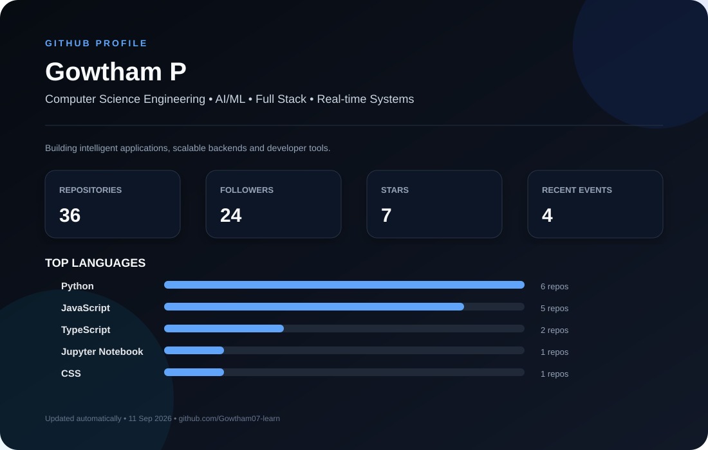

 

---

## 👋 About Me

I'm **Gowtham P**, a Computer Science Engineering student focused on building practical software, AI-powered applications, and real-time systems.

I enjoy working across the stack — from interfaces and APIs to **LLMs, RAG, AI agents, data streaming, and distributed systems**.

- 🎓 Computer Science Engineering @ PSG College of Technology
- 🤖 Building AI agents and intelligent applications
- 🚦 Building a real-time Smart Traffic Management System
- 🌐 Full-stack development with React, Next.js, Node.js and FastAPI
- ⚡ Interested in WebSockets, Kafka, Redis and scalable backend systems
- 🧠 Exploring AI agents, RAG, Google ADK and modern developer tooling

---

## 🚀 Featured Projects

| Project | What it does | Stack |
|---|---|---|
| 🤖 **Agentic Medical Chatbot** | Agentic/RAG-based medical assistant | Python · Google ADK · Gemini · RAG |
| 🚦 **Smart Traffic Management System** | Real-time traffic monitoring and adaptive signal simulation | React · FastAPI · PostgreSQL · Redis · WebSockets |
| 🔄 **DATA-SCRAPER-n8n** | Automated data collection and workflow pipeline | n8n · APIs · Webhooks |
| 🍳 **Multi-Agent Recipe System** | Multi-agent workflow for recipe generation | Python · AI Agents |
| 🧠 **Linear ML** | Machine-learning experiments and implementations | Python · ML |

> See all projects on my [GitHub repositories](https://github.com/Gowtham07-learn?tab=repositories).

---

## 🛠️ Tech Stack

### Languages
`C` `C++` `Python` `Java` `JavaScript`

### Frontend
`React` `Next.js` `HTML5` `CSS3` `Tailwind CSS`

### Backend
`Node.js` `Express` `FastAPI` `REST API` `WebSockets` `Webhooks`

### Databases & Infrastructure
`PostgreSQL` `MySQL` `MongoDB` `Redis` `Docker` `Supabase`

### AI / ML
`Machine Learning` `RAG` `LLMs` `Google ADK` `Gemini` `AI Agents`

### Data & Tools
`Kafka` `n8n` `Git` `GitHub` `Linux`

---

## 📈 GitHub Activity

The profile graphic above is regenerated automatically by **GitHub Actions** every day.

It updates repository count, followers, stars, recent public events, and top languages.

---

## 🏆 Highlights

- 🏅 Hackathon finalist / shortlisted projects
- 🚀 Production-style full-stack and AI projects
- 🔬 Real-time systems and intelligent automation
- 💻 Data Structures & Algorithms practice

---

## 📫 Connect

---

### ⚡ Build. Learn. Ship. Repeat.

Profile statistics are automatically refreshed by GitHub Actions.

